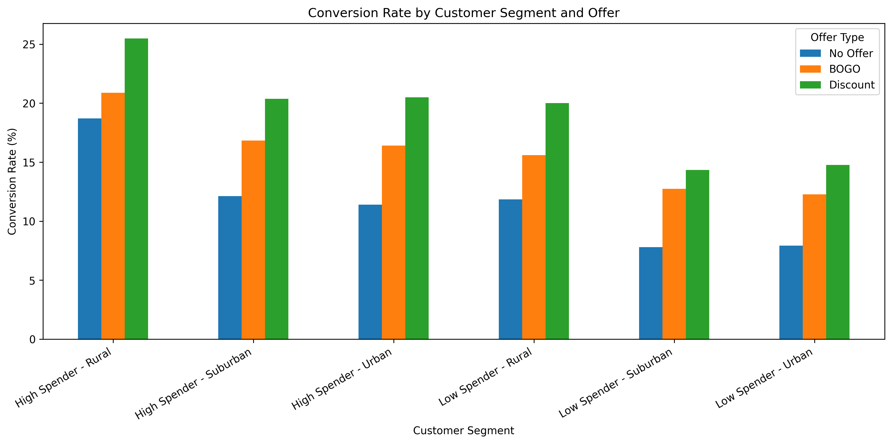
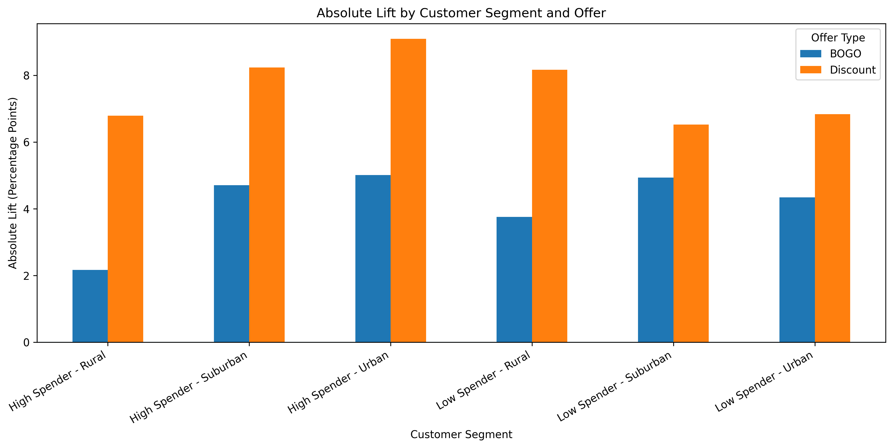

# A/B Test & Uplift Modeling

This project analyzes a public synthetic marketing promotion dataset to understand how different CRM campaign offers impact customer conversion. The goal is to go beyond basic campaign performance and identify which customers should receive an offer, which customers may not need one, and which customers may respond negatively to receiving a promotion.

## Project Goals

* Perform a deep-dive A/B test analysis comparing:

  * No Offer vs Discount
  * No Offer vs BOGO

* Analyze customer segments such as:

  * High spenders vs low spenders
  * Zip code type: Urban, Suburban, and Rural customers
  * Deeper combined segments such as High Spender + Urban, Low Spender + Rural, and other spender/zip-code combinations

* Estimate incremental lift to understand whether each offer created additional conversions compared to no offer.

* Build toward an uplift modeling workflow to classify customers into groups such as:

  * Persuadables: customers who need a small nudge to convert
  * Sure Things: customers likely to convert without an offer
  * Lost Causes: customers unlikely to convert even with an offer
  * Sleeping Dogs: customers who may respond negatively to receiving an offer

## Business Question

Should the promotion be sent to everyone, or only to selected customers?

## Current Phase

The current phase focuses on A/B test analysis and customer segmentation. Instead of treating the campaign as one A/B/C test, each offer is compared separately against the control group:

* No Offer vs BOGO
* No Offer vs Discount

This makes the analysis easier to interpret because each treatment is measured directly against the same baseline: customers who received no offer.

After the overall A/B test, the analysis first segments customers into High Spenders and Low Spenders. Then, the analysis goes one level deeper by combining spender segment with zip-code segment:

* High Spender + Rural
* High Spender + Suburban
* High Spender + Urban
* Low Spender + Rural
* Low Spender + Suburban
* Low Spender + Urban

This deeper segmentation helps identify whether certain customer groups respond differently to Discount or BOGO offers.

## Overall A/B Test Results

| Test                 | No Offer Conversion Rate | Treatment Conversion Rate | Absolute Lift | Relative Lift | Result                    |
| -------------------- | -----------------------: | ------------------------: | ------------: | ------------: | ------------------------- |
| BOGO vs No Offer     |                   10.62% |                    15.14% |      4.52 pts |        42.61% | Statistically significant |
| Discount vs No Offer |                   10.62% |                    18.28% |      7.66 pts |        72.14% | Statistically significant |

## Overall Key Findings

Both promotional offers outperformed No Offer.

BOGO increased conversion from **10.62% to 15.14%**, producing a **4.52 percentage-point lift** and a **42.61% relative lift**.

Discount increased conversion from **10.62% to 18.28%**, producing a **7.66 percentage-point lift** and a **72.14% relative lift**.

Based on conversion lift alone, **Discount was the stronger offer**. It outperformed BOGO by approximately **3.14 percentage points** in conversion rate.

This initial result showed that Discount already had strong potential for higher incremental lift, which made it important to test whether the same pattern held across customer segments.

## High Spender vs Low Spender Segment Analysis

Customers were segmented using the `history` column as a proxy for customer value. The `history` column represents the dollar value of historical purchases.

In the current analysis:

* **High Spenders** are customers with `history` greater than the median historical purchase value.
* **Low Spenders** are customers with `history` less than the median historical purchase value.

Customers exactly equal to the median were excluded from this version of the segment analysis because the segmentation logic used `>` for High Spenders and `<` for Low Spenders.

### Spender Segment Distribution

| Segment      | Definition         | Customers | Customer Share |
| ------------ | ------------------ | --------: | -------------: |
| High Spender | `history > median` |    31,999 |         50.00% |
| Low Spender  | `history < median` |    31,999 |         50.00% |

This median-based segmentation creates two nearly equal-sized customer groups, making it easier to compare campaign performance between higher-value and lower-value customers.

## High Spender vs Low Spender A/B Test Results

| Segment      | Test                 | No Offer Conversion Rate | Treatment Conversion Rate | Absolute Lift | Relative Lift | Z-Score | P-Value | Result                                  |
| ------------ | -------------------- | -----------------------: | ------------------------: | ------------: | ------------: | ------: | ------: | --------------------------------------- |
| High Spender | No Offer vs Discount |                   12.83% |                    21.19% |      8.36 pts |        65.14% |   16.20 |    0.00 | Statistically significant positive lift |
| High Spender | No Offer vs BOGO     |                   12.83% |                    17.27% |      4.43 pts |        34.56% |    9.06 |    0.00 | Statistically significant positive lift |
| Low Spender  | No Offer vs Discount |                    8.43% |                    15.38% |      6.95 pts |        82.50% |   15.71 |    0.00 | Statistically significant positive lift |
| Low Spender  | No Offer vs BOGO     |                    8.43% |                    12.98% |      4.55 pts |        53.95% |   10.74 |    0.00 | Statistically significant positive lift |

The p-values are displayed as **0.00** because they were rounded to two decimal places. This does not mean the p-values are literally zero; it means they are extremely small after rounding.

## Spender Segment Key Findings

Discount produced the strongest conversion lift in both customer value segments.

For **High Spenders**, Discount increased conversion from **12.83% to 21.19%**, producing an **8.36 percentage-point lift** and a **65.14% relative lift**.

For **Low Spenders**, Discount increased conversion from **8.43% to 15.38%**, producing a **6.95 percentage-point lift** and an **82.50% relative lift**.

BOGO also improved conversion in both segments, but the lift was smaller than Discount.

For **High Spenders**, BOGO increased conversion from **12.83% to 17.27%**, producing a **4.43 percentage-point lift** and a **34.56% relative lift**.

For **Low Spenders**, BOGO increased conversion from **8.43% to 12.98%**, producing a **4.55 percentage-point lift** and a **53.95% relative lift**.

Another important finding is that **High Spenders had a higher No Offer conversion rate than Low Spenders**. High Spenders converted at **12.83%** without an offer, while Low Spenders converted at **8.43%** without an offer. This suggests that High Spenders are more likely to convert naturally, even without receiving a promotion.

Overall, the spender segment analysis showed:

* Discount was the strongest offer for both High Spenders and Low Spenders.
* High Spenders had higher baseline conversion without an offer.
* Low Spenders had lower baseline conversion, but showed strong relative lift from Discount.
* BOGO created positive lift in both segments, but did not outperform Discount.

These findings supported moving into deeper segmentation to see whether the same pattern held across zip-code groups.

## Deeper Segment Analysis: High/Low Spender + Zip Code

The deeper segmentation combines customer value and zip-code type to better understand which customer groups respond most strongly to each offer.

The analysis compares each segment against its own No Offer baseline. This is important because each segment has a different natural conversion rate.

The deeper segments analyzed were:

* High Spender - Rural
* High Spender - Suburban
* High Spender - Urban
* Low Spender - Rural
* Low Spender - Suburban
* Low Spender - Urban

## Data Visualization

The deeper segmentation results are shown using two graphs:

* **Conversion rate by customer segment and offer**
* **Absolute lift by customer segment and offer**

The conversion rate graph shows how each offer performed inside each customer segment.

The absolute lift graph shows how much additional conversion each offer produced compared with No Offer. This is the more important graph for A/B test interpretation because it shows whether the promotion created incremental improvement beyond the baseline.

## Deeper Segmentation Key Findings

The deeper high/low spender + zip-code analysis confirmed the pattern from the initial segment analysis: **Discount consistently produced stronger lift than BOGO across every spender and zip-code segment**.

The strongest Discount lift came from **High Spender - Urban customers**, where conversion increased from **11.41% to 20.50%**, producing a **9.10 percentage-point lift**.

The second strongest Discount lift came from **High Spender - Suburban customers**, where conversion increased from **12.13% to 20.37%**, producing an **8.24 percentage-point lift**.

Discount also performed strongly for **Low Spender - Rural customers**, increasing conversion from **11.84% to 20.01%**, producing an **8.17 percentage-point lift**.

A notable finding is that **High Spender - Rural customers already had the highest baseline conversion rate**, converting at **18.70%** without any offer. Discount still produced statistically significant lift for this group, but BOGO did not. BOGO only increased conversion from **18.70% to 20.87%**, producing a **2.17 percentage-point lift** with a p-value of **0.1215**.

This suggests that High Spender - Rural customers may already be likely to convert without receiving BOGO, making BOGO less valuable for this segment.

Overall, the deeper segmentation shows:

* Discount produced the highest absolute lift in every spender + zip-code segment.
* BOGO created positive lift in most segments, but the lift was consistently smaller than Discount.
* BOGO did not produce statistically significant lift for High Spender - Rural customers.
* High Spender - Rural customers had the strongest natural conversion without an offer.
* High Spender - Urban customers had the strongest Discount lift.
* Low Spenders generally had lower baseline conversion, but still responded well to Discount.

## Business Interpretation

The results show that both BOGO and Discount were effective at increasing customer conversion compared to No Offer. However, a higher conversion rate does not automatically mean the promotion should be sent to every customer.

A full rollout may create unnecessary promotion costs by sending offers to customers who would have converted anyway. This is especially important because High Spenders already showed a stronger baseline conversion rate without any offer.

The deeper segmentation confirms that Discount is the strongest offer based on conversion lift. Discount produced the highest absolute lift across every high/low spender and zip-code segment. This suggests that Discount may be the better offer for driving incremental conversions.

However, the decision should not be based on conversion lift alone. The business also needs to consider the cost of each promotion. Discount may produce more conversions than BOGO, but if the discount reduces profit margin too much, it may not always be the most profitable option. Similarly, BOGO may produce lower conversion lift, but depending on product cost, inventory strategy, and margin, it could still be profitable in certain segments.

Based on the current analysis, Discount should be prioritized for further testing and targeted promotion strategy, but the final rollout decision should include both conversion lift and promotion cost.

## Decision Framework

The project evaluates whether a broad campaign rollout would create unnecessary promotion costs by sending incentives to customers who do not need them.

The final recommendation will prioritize a targeted CRM rollout by sending offers only to customers with positive estimated uplift, while suppressing offers for customers likely to convert without incentives or customers who may respond negatively.

Based on the analysis so far:

* Discount appears to be the strongest overall offer.
* Discount produced the highest conversion lift in both High Spender and Low Spender segments.
* Discount also produced the highest lift across all deeper spender + zip-code segments.
* High Spenders converted at a higher rate even without an offer, suggesting some may be likely to purchase naturally.
* High Spender - Rural customers had the highest No Offer conversion rate and did not show statistically significant lift from BOGO.
* Low Spenders had lower No Offer conversion rates but showed strong lift from Discount.
* BOGO also created positive lift in most segments, but it was weaker than Discount and did not significantly lift High Spender - Rural customers.
* Customer-level and segment-level differences should be considered before deciding on a full rollout.
* Promotion cost should be evaluated before making the final business recommendation.

## Limitations

This analysis focuses on conversion lift, not profit lift.

One key limitation is that the current analysis does not compare the cost of giving a Discount versus the cost of giving a BOGO offer. Discount produced stronger conversion lift across the tested segments, but the analysis does not yet account for how much revenue or margin is lost when giving a discount.

Because of this, Discount should not automatically be treated as the best final business decision. It is the strongest offer from a conversion standpoint, but the most profitable offer would require additional information such as:

* Average order value
* Product margin
* Cost of the Discount offer
* Cost of the BOGO offer
* Revenue generated from converted customers
* Whether customers would have purchased without an offer

Another limitation is that this is a public synthetic dataset. The analysis is useful for practicing A/B testing, segmentation, and uplift modeling, but real-world promotion decisions would require additional business context.

## Next Steps

The next phase will continue building toward uplift modeling to estimate which customers are most likely to be influenced by each offer.

Future improvements include:

* Continue customer segmentation across other features such as channel.
* Build an uplift modeling workflow to identify which customers should receive an offer and which customers should be excluded.
* Compare customer-level uplift predictions against segment-level findings.

The uplift modeling phase will focus on identifying:

* Persuadables: customers who are likely to convert because of the offer
* Sure Things: customers likely to convert without an offer
* Lost Causes: customers unlikely to convert even with an offer
* Sleeping Dogs: customers who may respond negatively to receiving an offer

## Tools Used

Python, Pandas, NumPy, scikit-learn, A/B Testing, Customer Segmentation, Uplift Modeling, Data Visualization

## Key Takeaway

A promotion should not be judged only by total conversion rate. The better CRM decision is to identify which customers are actually influenced by an offer, then target promotions toward customers with positive incremental lift.

The analysis shows that both Discount and BOGO increase conversion, but Discount is the stronger offer across the overall test, the High Spender vs Low Spender analysis, and the deeper High/Low Spender + Zip Code segmentation.

However, the final business decision should also include promotion cost. Discount produced higher conversion lift, but without cost and margin data, the project cannot yet conclude that Discount is always the most profitable offer.
